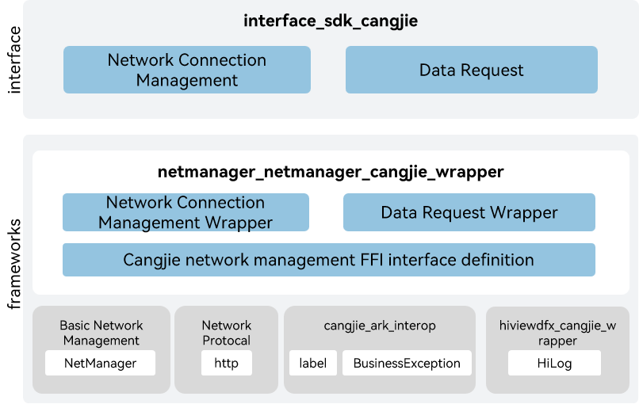

# netmanager_cangjie_wrapper

## Introduction

The netmanager_cangjie_wrapper is a Cangjie API encapsulated on OpenHarmony based on the capabilities of the net management Subsystem. As a mandatory component for device networking, the network management subsystem implements unified connection management, traffic management, policy management, network sharing of different types of networks, and provides network protocol stack capabilities. An application can call APIs to obtain connection information of a data network, query and subscribe to connection status, network traffic data, and network policy, share the network, and transfer data using a network protocol stack. The netmanager_cangjie_wrapper includes network connection management and services related to data requests. The network management cangjie interface currently under development only supports standard devices.

## System Architecture



**Figure 1** Architecture of the netmanager_cangjie_wrapper

As shown in the architecture diagram:

- Network Connection Management: Provides network management capabilities.
- Data Request: Provides HTTP data request capabilities.
- Cangjie network management FFI interface definition: Responsible for defining the C Language interoperability Cangjie interface, which is used to realize the Cangjie network management capabilities.
- Basic Network Management: Responsible for providing the basic functions of network management, and providing the package C Language interface to Cangjie for interoperability.
- Network Protocal Stacks: Responsible for providing the basic functions of network protocal stacks, and providing the package C Language interface to Cangjie for interoperability.
- cangjie_ark_interop: Responsible for providing Cangjie APILevel class definitions, which are used to annotate APIs, as well as providing the definition of BusinessException class that is thrown to users.
- hiviewdfx_cangjie_wrapper: Responsible for providing logging interfaces, which are used to print logs at key points in the execution path.

## Directory Structure

The structure of the repository directory is as follows:

```
foundation/communication/netmanager_cangjie_wrapper
├── figures                 # architecture pictures
├── kit                     # Cangjie kit code
│   └── NetworkKit
└── ohos                    # Cangjie Network Management code
│   └── net
│       ├── connection      # The interface for network connection
│       └── http            # The interface for HttpRequest
└── test                    # Cangjie test cases
    ├── connection          # connection test cases
    └── http                # http test cases
```

## Usage

The netmanager_cangjie_wrapper provides the following capabilities:

- Network Connection Management.
- Data Request.

Compared to ArkTS, the following features are currently not supported:

- Ethernet Connection Management.
- mDNS Management.
- Network Policy Management.
- Socket Connection.
- Traffic Management.
- Network Sharing.
- Enhanced VPN Management.
- VPN Management.
- WebSocket Connection.
- Network Firewall.
- Network Security.
- Extensible Authentication.
- Enhanced VPN Management.

For netmanager APIs, please refer to:
1. [Network Connection Management](https://gitcode.com/openharmony-sig/arkcompiler_cangjie_ark_interop/blob/master/doc/API_Reference/source_en/apis/NetworkKit/cj-apis-net-connection.md)
2. [Data Request](https://gitcode.com/openharmony-sig/arkcompiler_cangjie_ark_interop/blob/master/doc/API_Reference/source_en/apis/NetworkKit/cj-apis-net-http.md)

For relevation guidance, please refer to [Network Development Guide](https://gitcode.com/openharmony-sig/arkcompiler_cangjie_ark_interop/blob/master/doc/Dev_Guide/source_en/network)

## Code Contribution

Developers are welcome to contribute code, documentation, etc. For specific contribution processes and methods, please refer to [Code Contribution](https://gitcode.com/openharmony/docs/blob/master/en/contribute/code-contribution.md).

## Repositories Involved

[ark_compiler_cangjie_ark_interop](https://gitcode.com/openharmony-sig/arkcompiler_cangjie_ark_interop)

[communication_netmanager_base](https://gitcode.com/openharmony/communication_netmanager_base)

[communication_netstack](https://gitcode.com/openharmony/communication_netstack)

[hiviewdfx_hiviewdfx_cangjie_wrapper](https://gitcode.com/openharmony-sig/hiviewdfx_hiviewdfx_cangjie_wrapper)
