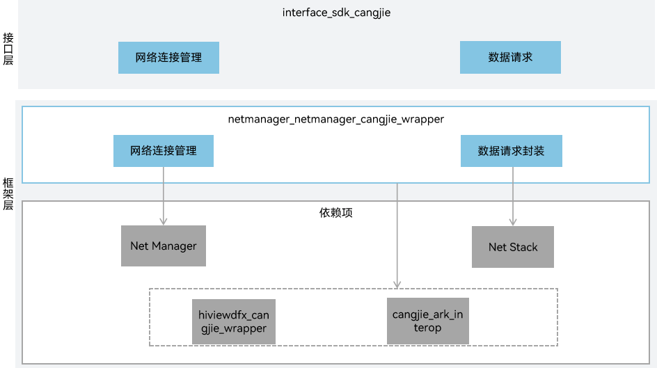

# 网络管理仓颉封装

## 简介

在OpenHarmony平台上，网络管理仓颉封装为开发者提供了使用仓颉语言进行应用开发时所需的网络管理相关的能力。网络管理作为设备联网的必备组件，提供了对不同类型网络连接的统一管理、流量管理、策略管理、网络共享，并提供了网络协议栈能力。应用可以通过调用API来获取数据网络的连接信息，查询和订阅数据网络的连接状态，网络流量数据，网络策略以及网络共享等，并可通过网络协议栈进行数据传输。网络管理仓颉封装包含了网络连接管理、协议栈相关业务，当前仅支持standard设备。

## 系统架构



接口层：

- 网络连接管理接口：提供管理网络能力，网络连接管理提供管理网络一些基础能力，包括获取默认激活的数据网络、获取所有激活数据网络列表、开启关闭飞行模式、获取网络能力信息等功能。
- 网络协议栈接口：提供HTTP数据请求能力，应用可以通过HTTP发起一个数据请求，支持常见的GET、POST、OPTIONS、HEAD、PUT、DELETE、TRACE、CONNECT方法。

框架层：

- 网络连接管理封装：仓颉网络连接管理的实现封装，提供网络连接管理能力。
- 网络协议栈封装：仓颉网络协议栈的实现封装，当前提供Http协议栈相关功能。

架构图中的依赖部件引入说明：

- Net Manager：提供基础网络连接管理能力，包括WiFi/蜂窝/Ethernet等多网络连接优先级管理、网络质量评估、订阅默认/指定网络连接状态变化、查询网络连接信息、DNS解析等功能等核心功能。
- Net Stack：提供基础的网络协议栈能力。
- cangjie_ark_interop：负责提供仓颉注解类定义，用于对API进行标注，以及提供抛向用户的BusinessException异常类定义。
- hiviewdfx_cangjie_wrapper：负责提供日志接口，用于在关键路径处打印日志。

## 目录

仓目录结构如下：

```
foundation/communication/netmanager_cangjie_wrapper
├── figures                 # 存放README中的架构图
├── kit                     # 仓颉kit化代码
│   └── NetworkKit
└── ohos                    # 仓颉网络管理接口实现
│   └── net
│       ├── connection      # 网络连接管理相关接口
│       └── http            # http协议相关接口
└── test                    # 测试代码
    ├── connection          # 网络连接管理测试用例
    └── http                # http测试用例
```

## 使用说明

当前网络管理仓颉封装提供了以下功能：

- 网络连接管理，包括获取默认激活的数据网络、获取所有激活数据网络列表、开启关闭飞行模式、获取网络能力信息等功能，典型应用场景包括：接收指定网络的状态变化通知、获取所有注册的网络、查询默认网络或者指定网络的连接信息、使用默认网络解析域名，获取所有IP。
- 网络协议栈，提供HTTP数据请求能力，应用通过HTTP发起一个数据请求，支持常见的GET、POST、OPTIONS、HEAD、PUT、DELETE、TRACE、CONNECT方法。当前提供了2种HTTP请求方式，若请求发送或接收的数据量较少，可使用HttpRequest.request，若是大文件的上传或者下载，且关注数据发送和接收进度，可使用HTTP请求流式传输HttpRequest.requestInstream。

网络管理相关API请参见：
1. [网络连接管理API参考](https://gitcode.com/openharmony-sig/arkcompiler_cangjie_ark_interop/blob/master/doc/API_Reference/source_zh_cn/apis/NetworkKit/cj-apis-net-connection.md)
2. [网络协议栈API参考](https://gitcode.com/openharmony-sig/arkcompiler_cangjie_ark_interop/blob/master/doc/API_Reference/source_zh_cn/apis/NetworkKit/cj-apis-net-http.md)

相关指导请参见[网络连接管理指南](https://gitcode.com/openharmony-sig/arkcompiler_cangjie_ark_interop/blob/master/doc/Dev_Guide/source_zh_cn/network/cj-net-connection-manager.md)以及[网络协议栈指南](https://gitcode.com/openharmony-sig/arkcompiler_cangjie_ark_interop/blob/master/doc/Dev_Guide/source_zh_cn/network/cj-http-request.md)。

## 约束

与ArkTS提供的API能力相比：

- 网络连接管理暂不支持以下功能：
  - MDNS管理。
  - 网络策略管理。
  - 流量管理。
  - 网络共享管理。
  - VPN增强管理。
  - VPN管理。
  - 网络防火墙。
  - 网络安全。
  - 扩展认证。
  - 三方VPN能力。

- 网络协议栈暂不支持以下功能：
  - WebSocket协议。
  - TCP/UDP/TLS Socket协议。

- 暂不支持网络管理扩展功能，包括以太网连接，热点网络共享。

## 参与贡献

欢迎广大开发者贡献代码、文档等，具体的贡献流程和方式请参见[参与贡献](https://gitcode.com/openharmony/docs/blob/master/zh-cn/contribute/%E5%8F%82%E4%B8%8E%E8%B4%A1%E7%8C%AE.md)。

## 相关仓

[arkcompiler_cangjie_ark_interop](https://gitcode.com/openharmony-sig/arkcompiler_cangjie_ark_interop)

[communication_netmanager_base](https://gitcode.com/openharmony/communication_netmanager_base)

[communication_netstack](https://gitcode.com/openharmony/communication_netstack)

[hiviewdfx_hiviewdfx_cangjie_wrapper](https://gitcode.com/openharmony-sig/hiviewdfx_hiviewdfx_cangjie_wrapper)